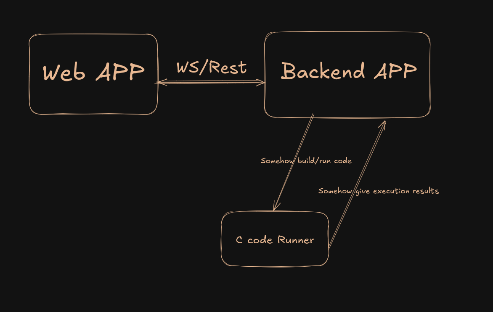
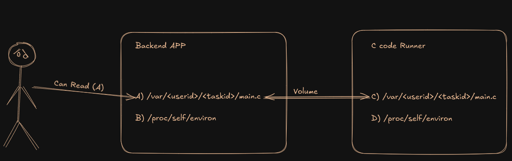
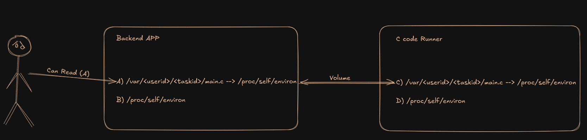

In this blog, I will share an interesting situation from my experience, 
discussing the problems that can arise when using Docker Volumes and how to 
avoid them.

**Disclaimer:**  
This blog:
- **IS NOT** a guide on exploiting vulnerabilities.
- **IS NOT** a best practices guide on system architecture.
- It’s just a fun description of how I looked for vulnerabilities in a friend's service.

# Introduction
Recently, the creators of a project asked me to test their service for potential vulnerabilities.
The main function of this service is to run and test C code.

# Initial Analysis
I didn’t get access to the code, so I studied it like a regular user.

At first glance, the service looks like this:
- A basic code editor (I think it was Ace Editor).
- Buttons: "Run Code," "Save Code," "Check Task."

First, I tried to understand how the code runs, where the results are stored, and how the service works internally.

When I first ran some code, I noticed the service behaved strangely when I 
entered certain "stop words." It would give an error saying, "The code 
contains a forbidden word." After 3-5 runs, I figured out what was happening...

This was the code sanitizer at work. The idea is simple: before running the 
code, the backend checks it for "stop words" (like "popen," "command," etc.) 
and if it finds any, it won’t allow the code to compile. This was meant to 
block remote command execution on their C code runner machine.  
I’m not an expert in C, so I had to spend some time bypassing this restriction.
I wrote a Python script that escapes the entire code like this:

```c
// Code before:
fp = popen(command, "r");

// Escaped code:
#define JeNcJ f\
p\
 \
=\
 \
p\
o\
p\
e\
n\
(\
c\
o\
m\
m\
a\
n\
d\
,\
 \
"\
r\
"\
)

JeNcJ;
```

And... success! I was able to run any command on their C code runner.

What’s next?

Next, I started exploring their runner from the inside.  
I quickly realized it was a separate Docker container because the hostname 
looked like a Docker container ID, and the machine itself was almost empty. 
The only unusual directory was `/var/<user-id>/<task-id>/`, where `main.c`, 
the compiled program, and the program’s input data were stored.

# Trying to Understand How the Service Works

So, what do we know?  
The assumed architecture looks like this:



Now the main question is... How do the Backend APP and C code runner communicate?

I started analyzing open connections on the C code runner but found nothing interesting.  
If it’s not through the network, how does the code get into the container?  
The code and input data are likely transferred into the container via Docker 
Volumes—a simple solution that seems ideal but... not quite.

## A Bit About Docker Volumes:
Docker Volumes are a mechanism for storing data that allows containers to save 
and share data with each other and the host system. They provide a way to 
persist data outside the container, which is important for keeping data intact 
even after the container is restarted or removed.

1. **Data Persistence:**
    - Data in a volume is stored outside the container and won’t disappear 
        when the container is deleted or stopped.
2. **Isolation:**
    - Volumes are independent of the container's filesystem, helping avoid 
        conflicts between data in different containers.
3. **Access from Containers:**
    - Volumes can be mounted in one or more containers, allowing them to share data.
4. **Host and Docker:**
    - Files stored in the volume are located on the host system but are 
        accessible through the Docker API, making data management easier.

## How Can This Be Exploited?
Docker Volumes are powerful, but they need to be used carefully. **NEVER** let 
users write and read data from a Docker Volume.

The developers’ idea was probably like this:
- Save the user’s code to `/var/<userid>/<taskid>/main.c` along with the task’s input data.
- Run a new container with the code and input data mounted via Docker Volumes.
- Compile the code.
- Run the code, sending the input file `/var/<userid>/<taskid>/inputs` to stdin and getting the result on stdout.
- Compare the results on the backend and provide a report to the user.

I decided to test my hypothesis and tried modifying the file `/var/<userid>/<taskid>/main.c` 
using a program inside the runner—the changes immediately reflected in the web app. Bingo!

In Linux, there’s an interesting feature — symbolic links (Symbolic Links). 
These are special types of files in Unix/Linux filesystems that act as 
pointers to other files or directories, providing an alternative way to access 
them. Symbolic links work regardless of where they’re created. Convenient, right?

# Final Part

Now, let’s exploit the vulnerability using symbolic links:
1. Create a symbolic link `/var/<userid>/<taskid>/main.c` -> `/proc/self/environ`.
2. Refresh the page to load the content from `/var/<userid>/<taskid>/main.c` on the main machine.
3. Remove the symbolic link and write something to the file.
4. It worked! We got the environment variables from the main machine!

**Final command:**
```bash
rm main.c && ln -s /proc/self/environ main.c && sleep 10 && rm main.c &&
echo "some text" > main.c
```

In diagrams, it looks like this:
- Normally, the service looks like this during code execution: 
	<!--  -->
    
- But if we create a symbolic link from C to D, everything changes:
	
	Now, when the user reads `/var/<userid>/<taskid>/main.c` on the main machine, 
    they actually get the content from `/proc/self/environ` on the main 
    machine (since the link created inside the runner still works and points to the real path on the main machine)!

# How to Prevent This?

There are many solutions, each addressing the problem at different levels. Here are some:
- Use gRPC, queue, REST API... Basically, any method for service communication 
    other than direct filesystem manipulation.
- Copy files into the Docker container instead of using Docker Volumes. 
    Although this solution isn’t the most elegant, but it should fix the 
    problem described.
- Use WebAssembly (WASM) to run the code. This would make it easier to impose 
    restrictions on the user and improve system security, as well as eliminate the 
    need for separate Docker containers for each code execution.
- Don’t link the code to the standard library to limit the functions available 
    to the user, eliminating the need for code sanitization.

# Conclusion

Finally, I’d like to thank the creators of the service for the opportunity to 
explore their service. I gained valuable experience and learned a lot by 
analyzing their project.

Thanks for reading! If you have any questions, leave them in the comments. 
Have a great day!