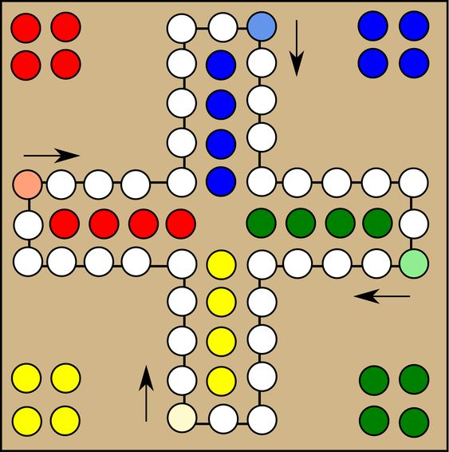

## Introduction
Recently, I got a simple yet intriguing project: to create a 
"Man Don't Get Angry" game. An idea struck me immediately on 
how to approach it. This assignment, intended for a group of 
students, opened up many creative possibilities. In this blog, 
I'm excited to share my concept with you.

## Rules
1. Objective: The main goal is to move all four of your game 
pieces around the board and into your "home" row before your opponents.
0. Players: The game is typically played by 2 to 4 players.
0. Starting the Game: Each player chooses a color and places 
their four pieces in the corresponding starting area. Players 
take turns rolling a die, and the one who rolls the highest 
number starts the game. To move a piece out of the starting 
area onto the track, a player must roll a six.
0. Movement: Players take turns rolling a single die and move 
one of their pieces clockwise around the board according to the 
number rolled. Rolling a six grants another turn. If a piece 
lands on a space already occupied by an opponent's piece, the 
opponent's piece is sent back to their starting area.
0. Safe Spaces: Certain spaces on the board are marked and are 
safe from capture. Pieces on these spaces cannot be replaced by 
opponents' pieces.
0. Home Stretch: Once a piece has completed a full circuit of 
the board, it enters the "home" row or column. This is a 
colored path leading to the "home" spaces.
0. Winning the Game: The first player to get all four of their 
pieces into their "home" spaces wins. The game can continue to 
determine the second, third, and fourth places.

## Board
"Man Don't Get Angry" is a classic board game similar to "Ludo." 
The game board typically features a square layout with a 
cross-shaped, color-coded track in the center, divided into 
four arms. Each arm has three rows of squares, with the middle 
row used as the player's home column. At the end of this column,
there's a larger square or circle, often labeled as the "home" 
or "finish" area.

Each of the four corners of the board contains a player's 
starting area, distinguished by distinct colors (usually red, 
green, yellow, and blue). These areas often have four slots or 
circles where the player's pieces begin the game.

The game's objective is for players to move their pieces around 
the board and into their home column by rolling a die. The 
challenge comes from pieces being sent back to their starting 
area if another player lands on the same square.

The design is simple yet colorful, emphasizing clear 
demarcation of each player's path and home area. The central 
part of the board, where the arms of the cross intersect, is 
often embellished with decorative elements related to the game's theme.

## Implementation
I want to start by discussing what the board looks like and how 
we would represent it in data structures.  

### Naive approach
You can see that the board looks like a plus sign. Intuitively, 
you may want to represent it as a matrix and fill this matrix with 
some objects (such as the players' row and the finish area). 
Then put the players in the correct positions and move them 
along the row in the correct direction.  

This approach is OK, but it has a number of problems:

1. Too many invalid states. When you move your player, he can 
be moved in the wrong direction 75% of the time (you have up, 
down, left, right directions, but only one is correct).
0. It is too difficult to calculate the next position. We can't
quickly decide which way to move the player. The easiest way 
is to remember each player's previous position and move in the 
opposite direction. But this is where we face the problem of 
the twists and turns.

### Better approach
I propose a simpler solution.

Previously, I described the path that a player moves along as a 
'row'. This path is homeomorphic to a circle. The player can 
only move forward, with no option to move backwards.

Suppose our board is of size $x \times x$ (where $x$ is an odd, 
positive number). Then, the length of the path is $4 * (x-1)$.

The starting position for the first player is $0 * (x-1) = 0$, 
positions for the second, third, and fourth players 
are $1 * (x-1)$, $2 * (x-1)$, and $3 * (x-1)$ respectively.

We can easily calculate a player's next position as follows:   
$player.position = player.position + steps$  

When a player collides with another, set another's player 
position to the spawn:  
$player.position = player.color * (board.size - 1)$

If a player's position exceeds his spawn point $-1$ it is in
the finish area (or home area). So representation of home can be various.
For example, we can set player's position to the negative number 
(the specific implementation is not important in this example, 
the main thing is that the players do not collide)

When a player is in the finish area, they can only move forward.

The finish area's length is $\frac{x-1}{2} - 1$. 

## Conclusion
Anyway, which variant you choose is up to you. I think I've explained simply enough how I see modeling this game.
